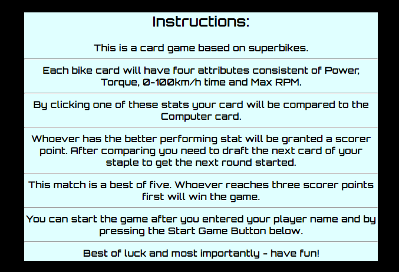

# Superbike Cards 2023 Edition  
 
## Description
Welcome to the world of 'Superbike Cards 2023 Edition', where the versatility of JavaScript brings the newest superbikes into your browser. Get ready to immerse yourself in a card game that combines excitement, strategy, and an in-depth exploration of 2023's street-legal superbikes. Best of all, it's fully responsive, ensuring you can enjoy the game seamlessly on smartphones, tablets, and computers of various screen sizes.

In this game, you'll go head-to-head against a computer opponent, making strategic comparisons between your superbike cards and the opponent. But here's the twist – each card represents a real-world 2023 superbike, and the game's functionality and features, all thanks to JavaScript, ensure a seamless and immersive gaming experience across different devices.

As you collect cards, you'll deepen your knowledge of the newest superbikes on the market. 'Superbike Cards 2023 Edition' is not just a game, it's a captivating learning experience, where you can appreciate the power, style, and innovation of these incredible machines.

So, whether you're on your smartphone during a coffee break, using your tablet on a lazy Sunday afternoon, or enjoying it on your computer with friends, 'Superbike Cards 2023 Edition' is your passport to bike aficionado enlightenment. Let the games begin!" 🏍️🃏🏁📱💻

[Click here to view the Live Project](https://arp-25.github.io/superbike_cards/index.html)

## Table of contents

- [User Experience (UX)](#User-Experience-(UX))
- [Features](#Features)
- [Design](#Design)
- [Technologies Used](#Technologies-Used)
- [Testing](#Testing)
- [Deployment](#Deployment)
- [Credits](#Credits)

## User Experience (UX)

### User stories

#### Start Page: 

1. Get a idea what the purpose of the page is about and see clear and concise instructions on how the game works so that I can quickly understand how to play.

2. Be able to enter my username so that I can personalize my gaming experience.

3. Receive feedback if I enter an invalid or empty username so that I know what I need to correct.

4. Have a "Start Game" button on the instructions page so that I can begin playing the game.

#### Game Page:

5. Have clear and intuitive game controls to interact with the game effectively.

6. Receive instructions or guidance on how to play the game against the computer.

7. See my current score or progress during the game so that I can track my performance.

8. Have the option to exit the game and return to the instructions page in case I want to review the game rules, change my username or simply start a new game.

## Features

### Existing Features

#### Start Page

-  F01 Header 
    -   Logo
        
-  F02 Instructions
    -   Step by step game instructions
     
-  F03 Player Name Input
    -   A input field for the player name
    -   Personalizing game experience
    -   Input is required and limited to ten characters
     

-  F04 Start Game Button
    -   Button to enter the Game by "onclick"
    -   Will check if Player Name is entered
     

#### Game Page

-  F05 Header 
    -   Logo
     
-  F06 Cards
    -   Card Area consistend of Player Card and Computer Card
    -   Player Card is interactive and give the player the option to choose a attribute to enter the battle
    -   Computer Card will get revealed after Player engaged the battle so the Player will be able to see if he won or lost the round
     
-  F07 Draft Next Card Button
    -   Interactive Button for Player to draft his next card
    
-  F08 Scores
    -   Score area to showcase the current scores of Player and Computer
    
-  F09 Return to Start Page Button
    -   Button which brings you back to the Start Page by "onclick"

### Table of Features and User Stories combined

In this table you can see that every User Story is covered by an implemented Feature.

|     | US 1     | US 2     | US 3     | US 4     | US 5     | US 6     | US 7     | US 8     | 
|-----|----------|----------|----------|----------|----------|----------|----------|----------|
| F 1 |     x    |          |          |          |          |          |          |          |
| F 2 |     x    |          |          |          |          |          |          |          |
| F 3 |          |    x     |   x      |          |          |          |          |          |
| F 4 |          |          |          | x        |          |          |          |          |
| F 5 |     x    |          |          |          |          |          |          |          |
| F 6 |          |          |          |          |  x       | x        | x        |          |
| F 7 |          |          |          |          |  x       | x        | x        |          |
| F 8 |          |          |          |          |  x       | x        | x        |          |
| F 9 |          |          |          |          |  x       |          |          |      x   |

### Features which could be implemented in the future

- Graphical Score Count.
- Database with previous player and ranking system which can be inspected from webpage.
- Terminal that displays info about game cycle (rounds, drafts and what the next step in the game is).

## Design

-   ### Imagery
    -   The card pictures are all realistically representing the associated card specs which are both not fictional.

-   ### Colour Scheme
    -  The color Scheme is adjusted to mainly provide good contrast and readability still offering an appealing design and fit the theme of superbikes.
    -  The specific areas have the background-color: "rgb(51,51,51)". Which is a dark gray similar to asphalt.
    -  For logo and certain elements "#FFA500" and "aqua" were used. These two provide a modern, race sport and game oriented look.
    -  Font Color is adjusted through the game to give good contrast to specific background-color.

-   ### Typography
    -   Google Fonts was used to import font into styles.css. Orbitron and Bangers were chosen to introduce a dynamic contrast. Orbitron represents sleek futuristic technology, focusing on precision and speed, while Bangers bring a gritty, rebellious vibe with raw power and aggression. This choice adds diversity, balance, and engaging gameplay to the experience, appealing to a wide range of players.

-   ### Wireframes

    [WireFrames Superbike Cards 2023 Edition](https://www.figma.com/file/wmXvMsoPH0Q0xPqbRAXWVs/Superbike-Cards-2023-Edition?type=design&node-id=0-1&mode=design&t=28Gqof5EH0XBYHV7-0)

    

## Technologies Used

### Languages Used

-   [HTML5](https://en.wikipedia.org/wiki/HTML5)
-   [CSS3](https://en.wikipedia.org/wiki/Cascading_Style_Sheets)
-   [Javascript](https://en.wikipedia.org/wiki/JavaScript)
-   [Markdown](https://de.wikipedia.org/wiki/Markdown)

### Frameworks, Libraries & Programs Used

-   [Gitpod:](https://gitpod.io) was used as IDE to create the code. It provides good compatibility with github and offers useful IDE extensions.
-   [Google Fonts:](https://fonts.google.com/) was used to import fonts.
-   [Font Awesome:](https://fontawesome.com/) was used to add icons for aesthetic and UX purposes.
-   [GitHub:](https://github.com/) is used as the respository for the projects code after being pushed from Git.
-   [ILoveImg:](https://www.iloveimg.com) was used for resizing images and editing photos for the website.
-   [Figma:](https://www.figma.com/) was used to create the wireframes during the design process.

## Testing

### Validator Testing

For validator testing https://validator.w3.org/, https://jigsaw.w3.org/css-validator/  and https://jshint.com/ were used. The code runs totally error free and has only negligible warnings.

### Performance

Google Lighthouse in Google Chrome Developer Tools was used to test the performance of the website.

### Browser Compatibility

- Testing has been carried out on the following browsers :
    - Chrome Version 115.0.5790.111 (Official Build) (64-bit)
    - Firefox Version 116.0 (64-bit)
    - Edge Version 115.0.1901.188 (Official build) (64-bit)
    - Safari on iPhone (iOS-Version 14.6 (c))

### Test Cases and Results

