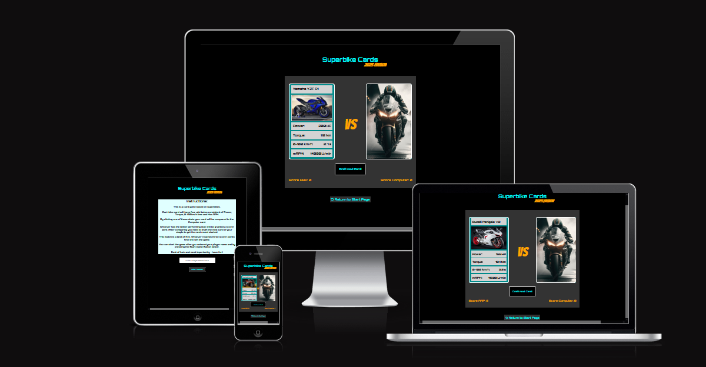

# Superbike Cards 2023 Edition  
 
## Description
Welcome to the world of 'Superbike Cards 2023 Edition', where the versatility of JavaScript brings the newest superbikes into your browser. Get ready to immerse yourself in a card game that combines excitement, strategy, and an in-depth exploration of 2023's street-legal superbikes. Best of all, it's fully responsive, ensuring you can enjoy the game seamlessly on smartphones, tablets, and computers of various screen sizes.

In this game, you'll go head-to-head against a computer opponent, making strategic comparisons between your superbike cards and the opponent. But here's the twist – each card represents a real-world 2023 superbike, and the game's functionality and features, all thanks to JavaScript, ensure a seamless and immersive gaming experience across different devices.

As you collect cards, you'll deepen your knowledge of the newest superbikes on the market. 'Superbike Cards 2023 Edition' is not just a game, it's a captivating learning experience, where you can appreciate the power, style, and innovation of these incredible machines.

So, whether you're on your smartphone during a coffee break, using your tablet on a lazy Sunday afternoon, or enjoying it on your computer with friends, 'Superbike Cards 2023 Edition' is your passport to bike aficionado enlightenment. Let the games begin!" 🏍️🃏🏁📱💻

[Click here to view the Live Project](https://arp-25.github.io/superbike_cards/index.html)

## Table of contents

- [User Experience (UX)](#User-Experience-(UX))
- [Features](#Features)
- [Design](#Design)
- [Technologies Used](#Technologies-Used)
- [Testing](#Testing)
- [Deployment](#Deployment)
- [Credits](#Credits)

## User Experience (UX)

### User stories

#### Start Page: 

1. Get a idea what the purpose of the page is about and see clear and concise instructions on how the game works so that I can quickly understand how to play.

2. Be able to enter my username so that I can personalize my gaming experience.

3. Receive feedback if I enter an invalid or empty username so that I know what I need to correct.

4. Have a "Start Game" button on the instructions page so that I can begin playing the game.

#### Game Page:

5. Have clear and intuitive game controls to interact with the game effectively.

6. Receive instructions or guidance on how to play the game against the computer.

7. See my current score or progress during the game so that I can track my performance.

8. Have the option to exit the game and return to the instructions page in case I want to review the game rules, change my username or simply start a new game.

## Features

### Existing Features

#### Start Page

1.  Header    
2.  Instructions
3.  Player Name Input
4.  Start Game Button

#### Game Page

5.  Header
6.  Cards
7.  Draft Next Card Button
8.  Scores
9.  Return to Start Page Button

### Table of Features and User Stories combined

In this table you can see that every User Story is covered by an implemented Feature.

|     | US 1     | US 2     | US 3     | US 4     | US 5     | US 6     | US 7     | US 8     | 
|-----|----------|----------|----------|----------|----------|----------|----------|----------|
| F 1 |     x    |          |          |          |          |          |          |          |
| F 2 |     x    |          |          |          |          |          |          |          |
| F 3 |          |    x     |   x      |          |          |          |          |          |
| F 4 |          |          |          | x        |          |          |          |          |
| F 5 |     x    |          |          |          |          |          |          |          |
| F 6 |          |          |          |          |  x       | x        | x        |          |
| F 7 |          |          |          |          |  x       | x        | x        |          |
| F 8 |          |          |          |          |  x       | x        | x        |          |
| F 9 |          |          |          |          |  x       |          |          |      x   |

### Features which could be implemented in the future

- Graphical Score Count
- Database with previous player and ranking system which can be inspected from webpage

